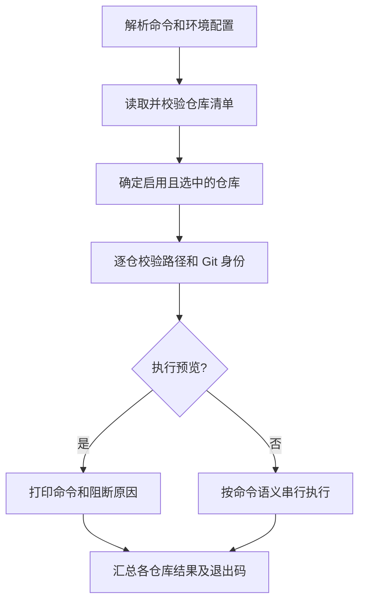

# DemoMultiGitRepoManager 多 Git 代码仓管理方案

日期：2026-10-06  
状态：一次性交付；已实现 Git 管理、构建调度、DSH 配置和 Desktop 接入。验证记录见 `docs/management-validation.md`。

本方案参考 `D:\projectZJGG\ProjectManager` 的 `submodules.ini`、`envVar_v2.ini`、`envBuild.py` 及其公共辅助模块，为本工程建立“仓库清单 + 环境配置 + Python 统一入口”的管理方式。所有受脚本管理的业务 Git 仓库均位于 `dsh-plugins/`。

## 1. 目标与本次范围

本次提供以下能力：

- 用 `submodules.ini` 显式登记子仓库的名称、相对路径、远程地址和目标分支。
- 用 `envVar_v2.ini` 管理工具位置、执行参数和 DeepSeek Harness Desktop 安装目录，支持不同机器使用不同路径。
- 用 `python envBuild.py <命令>` 统一执行初始化配置、清单检查、批量克隆、状态查看、获取远程更新、拉取、推送和分支切换。
- 支持按仓库选择、执行预览、逐仓输出、失败汇总和可靠退出码。
- 接管已经存在的两个独立仓库；新增仓库时主要修改清单。

本次一次性建设外层工程的 Git 管理、环境配置、插件构建调度、DSH JSON 一致性检查和 Desktop 启动／安装／目录选择适配入口；同时统一两个插件的工程配置文件名及安装包输出目录，更新相关源码、打包脚本、文档和测试。插件依赖版本保持现有约定。

主仓库自身的提交、拉取和推送由开发者在根目录单独完成，不隐式加入子仓库批量操作。

## 2. 实施前已核实的工程现状

### 2.1 主仓库

- 当前 Git 跟踪文件为 `.gitignore`、`LICENSE`、`README.md`；`README.md` 内容为“无”。
- 根目录尚无 `submodules.ini`、`envVar_v2.ini` 和 `envBuild.py`。
- `.gitignore` 工作区已增加 `dsh-plugins` 忽略项，该修改尚未提交，实施时保留。
- 两个插件目录都有自身 `.git`，属于独立仓库；主仓库索引没有指向它们的 Git gitlink。
- 本次检查中两个子仓库工作区均未报告改动。此状态只代表检查时刻，执行任何写操作前仍须重新检查。

### 2.2 首批纳管仓库

| 清单名称／目录名称 | 当前远程地址（origin） | 当前分支 | 本地 origin/HEAD |
| --- | --- | --- | --- |
| `dsh-multi-git-repo-manager` | `git@github.com:wuqingzhong2020/dsh-multi-git-repo-manager.git` | `main` | `origin/main` |
| `dsh-file-review-tab-Multi-git-repository` | `ssh://git@ssh.github.com:443/wuqingzhong2020/dsh-file-review-tab-Multi-git-repository.git` | `main` | `origin/main` |

清单初始远程地址按现有仓库实际配置保留，不统一改写 SSH 地址或端口。目录名保留 `Multi` 的大小写；审查插件的 npm 包名为小写 `dsh-file-review-tab-multi-git-repository`，不能据此重命名磁盘目录。

### 2.3 两个插件之间的现有关系

- 管理插件当前版本为 `0.1.4`；审查插件当前版本为 `0.3.5`。
- 审查插件 `package.json` 中的管理插件 peer/dev 依赖固定为 `0.1.4`。
- 审查插件 `pnpm-workspace.yaml` 已通过 `link:../dsh-multi-git-repo-manager` 使用相邻管理仓库。
- 审查插件 `docs/REPOSITORY_MANAGER.md` 明确要求先完成管理仓库构建，再构建审查仓库；两个构建不能并行，因为管理仓库构建会清理消费者链接使用的类型产物。
- 插件现有开发文档采用 Node.js 24、pnpm 11；Git 管理功能本身仅需要 Python 和 Git。

## 3. 从参考工程沿用与调整的内容

| 参考工程机制 | 本工程处理方式 |
| --- | --- |
| `submodules.ini` 每个 section 保存 `path/url/branch` | 沿用文件名与核心字段，路径统一指向 `dsh-plugins/` 下的仓库 |
| `envVar_v2.ini` 按平台保存环境参数 | 沿用文件名与平台分组，配置 Git、Node、pnpm、Desktop 路径，不迁入 Qt/MSVC/第三方 SDK 参数 |
| `envBuild.py` 作为命令入口，辅助逻辑在 `pythonProject/` | 沿用入口与模块组织，只抽取本工程需要的功能 |
| `clone/status/pull/push/branch/showUrl/batch` | 保留主要命令习惯，补充目标选择、检查、预览及结果汇总 |
| `branchReset` 实际执行 `git switch <branch>` | 保留兼容名称，并提供更明确的 `switch` 别名；不执行 `git reset` |
| 逐个仓库调用 Git | Git 管理与构建串行执行，构建遵守插件依赖顺序 |
| 部分目录操作与 clone 目标使用相对当前工作目录的路径 | 全部从脚本所在工程根定位，允许从其他目录调用入口 |
| 子仓库命令返回码未完整汇总到入口 `success` | 所有结果统一汇总，任一失败不能返回整体成功 |
| 普通 `git pull` | 内置 pull 使用 `--ff-only`，分支不符合配置时拒绝执行 |
| 环境读取可能自动补全并写回配置 | 普通读取只读，只有明确的初始化命令创建缺失模板，不静默改写已有文件 |

参考工程名称中的 `submodules` 在这里表示仓库清单。采用独立 clone 的多仓库模式，不转换成 Git 原生 submodule，不引入 `.gitmodules` 或主仓库 gitlink。

## 4. 推荐目录结构与文件职责

```text
DemoMultiGitRepoManager/
├── .gitignore
├── README.md
├── submodules.ini                    # 提交：仓库身份和目标分支
├── envVar_v2.ini                     # 提交：通用环境模板与默认参数
├── envVar_v2.local.ini               # 忽略：可选的本机覆盖配置
├── envBuild.py                       # 提交：统一 CLI 入口
├── pythonProject/
│   ├── __init__.py
│   ├── common.py                     # 根路径、进程执行、结果模型
│   ├── repo_config.py                # 仓库清单解析与校验
│   ├── env_config.py                 # 平台配置、覆盖、工具解析
│   ├── git_manager.py                # Git 检查和批量操作
│   ├── dsh_config.py                 # DSH v2 创建与一致性检查
│   ├── plugin_tasks.py               # 构建依赖调度与包校验
│   ├── package_artifacts.py          # 历史包、latest 副本与索引校验
│   ├── desktop.py                    # Desktop 启动／安装／适配
│   └── workflow.py                   # 编译、打包、安装和启动的完整流程
├── tests/
│   └── ...                           # 管理脚本的定向验证
├── docs/
│   └── multi-git-repository-management-plan.md
└── dsh-plugins/                      # 保留忽略：每个目录是独立 Git 仓库
    ├── dsh-multi-git-repo-manager/
    └── dsh-file-review-tab-Multi-git-repository/
```

`dsh-multi-git-repo.json` 可由已有管理插件在根目录创建，用于 DSH 内的管理和审查范围；它与上述脚本清单的关系见第 9 节。

实现优先使用 Python 标准库：`argparse`、`configparser`、`pathlib`、`subprocess`、`shutil` 等，不要求安装 GitPython。建议支持 Python 3.10 及以上；Windows 为首要验证环境，同时保持 Linux/WSL 的路径与进程调用兼容。

## 5. 仓库清单设计：submodules.ini

### 5.1 初始配置示例

以下配置已落地到工程根目录，审查仓库通过 depends_on 声明管理仓库依赖。

```ini
[dsh-multi-git-repo-manager]
path = dsh-plugins/dsh-multi-git-repo-manager
url = git@github.com:wuqingzhong2020/dsh-multi-git-repo-manager.git
branch = main
remote = origin
enabled = true

[dsh-file-review-tab-Multi-git-repository]
path = dsh-plugins/dsh-file-review-tab-Multi-git-repository
url = ssh://git@ssh.github.com:443/wuqingzhong2020/dsh-file-review-tab-Multi-git-repository.git
branch = main
remote = origin
enabled = true
depends_on = dsh-multi-git-repo-manager
```

### 5.2 字段与校验

| 字段 | 要求 | 含义 |
| --- | --- | --- |
| section 名称 | 必填、唯一 | 稳定仓库标识，供 `--repo` 选择 |
| `path` | 必填 | 相对于主工程根目录的仓库路径 |
| `url` | 必填 | 克隆来源及指定 remote 的身份校验依据 |
| `branch` | 必填 | 克隆与切回时使用的目标分支；不表示锁定某次提交 |
| `remote` | 可选，默认 `origin` | fetch、pull、push 使用的远程名称 |
| `enabled` | 可选，默认 `true` | 是否参与批量操作 |
| `depends_on` | 可选，逗号分隔清单名称 | 构建依赖，检查引用与循环关系 |

解析规则：

1. 配置路径使用正斜杠，读取时兼容 UTF-8 BOM；关闭 ConfigParser 的隐式 `%` 插值，字段名称规则固定。
2. `path` 必须是 `dsh-plugins/` 下的非空子路径，不能等于容器本身，不能是绝对路径或通过 `..` 逃逸。
3. 对已有目录和待创建目录的已有祖先解析真实路径，拒绝通过符号链接／Windows junction 指向工程外。
4. 拒绝重复、重叠的仓库路径；Windows 按平台规则比较路径大小写，Linux 保持大小写敏感。
5. 拒绝缺失必填字段、非法布尔值、非法 Git 分支名和不受支持的字段；remote 和 URL 不能以 `-` 开头而被解释为命令选项。URL 不接受嵌入密码或 token；认证由既有 SSH／Git credential 配置负责。
6. 初始 `remote` 使用 `origin`；若配置其他名称，clone 必须通过 `--origin <remote>` 建立相应 remote，不能只对后续命令替换名称。
7. 未登记的目录不自动加入批量操作。`check` 可报告 `dsh-plugins/` 直接子目录中发现的未登记仓库，待维护者补入清单。
8. `enabled=false` 的仓库只在清单检查中展示；`--repo` 指向禁用仓库时明确报错，不隐式启用。

远程地址本次按去除首尾空白后的配置值严格比较，不推断不同 SSH 别名、端口和 URL 写法是否等价。发现不一致时报告差异，不自动改写 remote。推送前还需检查实际 push URL，避免 fetch 地址相同但 push 指向其他仓库。

## 6. 环境配置设计：envVar_v2.ini

### 6.1 参数组织

采用 `MRM_` 前缀表示本工程 Multi Repo Manager 参数，避免混用参考工程的 Qt/C++ 参数，也避免覆盖 DSH 自身已有环境变量。

```ini
[envVar_all]
MRM_GIT_EXE =
MRM_NODE_EXE =
MRM_PNPM_EXE =
MRM_GIT_TIMEOUT_SECONDS = 30
MRM_NETWORK_TIMEOUT_SECONDS = 300
MRM_TASK_TIMEOUT_SECONDS = 900

[envVar_windows]
MRM_DSH_DESKTOP_DIR =
MRM_DSH_DESKTOP_EXE =
MRM_DSH_PROFILE_DIR =

[envVar_linux]
MRM_DSH_DESKTOP_DIR =
MRM_DSH_DESKTOP_EXE =
MRM_DSH_PROFILE_DIR =
```

| 参数 | 解析规则与用途 |
| --- | --- |
| `MRM_GIT_EXE` | 非空时使用配置的 Git；为空时从 PATH 查找。所有仓库操作需要此工具 |
| `MRM_NODE_EXE` | Node 工具位置；构建和 Desktop 适配需要，Git 管理不依赖 |
| `MRM_PNPM_EXE` | pnpm 工具位置；为空时从 PATH 查找，Windows shim 解析为 Node + JS 入口 |
| `MRM_GIT_TIMEOUT_SECONDS` | 本地 Git 子命令超时；必须为正整数 |
| `MRM_NETWORK_TIMEOUT_SECONDS` | clone/fetch/pull/push/batch 的单仓超时；必须为正整数 |
| `MRM_TASK_TIMEOUT_SECONDS` | pnpm 任务、Desktop 安装／适配超时；必须为正整数 |
| `MRM_DSH_DESKTOP_DIR` | DeepSeek Harness Desktop 安装目录，必须从配置取得，不在 Python 脚本中写死 |
| `MRM_DSH_DESKTOP_EXE` | 可选的程序完整路径；非空时优先使用，支持程序名称或安装布局不同的机器 |
| `MRM_DSH_PROFILE_DIR` | 可选的 Desktop Profile 路径，供安装接入；与应用安装目录分开配置 |

工具路径非空但无效时明确报错，不静默回退到另一份 PATH 工具。相对配置路径统一相对于主工程根解析；支持用户目录及明确的环境变量展开，未能展开的变量报告为配置问题。

### 6.2 Desktop 路径必须可配置

用户提出的 `D:\app\DeepSeekHarnessDesktop` 已填写到本工程 Windows 配置中，可按机器修改；`init` 在新工作区生成的模板留空。Python 不含固定安装路径，也不猜测未配置的安装位置。

当前 Windows 机器可以在 `envVar_v2.ini` 对应节点填写：

```ini
[envVar_windows]
MRM_DSH_DESKTOP_DIR = D:/app/DeepSeekHarnessDesktop
MRM_DSH_DESKTOP_EXE =
MRM_DSH_PROFILE_DIR =
```

同一个字段也可以写在不提交的 `envVar_v2.local.ini` 中，覆盖共享模板。例如另一台机器安装在 `E:/tools/DeepSeekHarnessDesktop`，只需修改本机配置。

Desktop 可执行文件解析顺序：

1. 非空的 `MRM_DSH_DESKTOP_EXE`。
2. Windows 下由 `MRM_DSH_DESKTOP_DIR` 拼接 `DeepSeek Harness.exe`。
3. Linux 下需要配置明确的可执行文件路径，不套用 Windows 文件名。

Desktop 目录选择适配脚本已接入，其 `resources/app.asar` 参数也从 `MRM_DSH_DESKTOP_DIR` 解析；可执行文件在其他布局时要求安装目录明确配置。不修改插件源码中的业务逻辑来适配每台机器的路径。

`MRM_DSH_PROFILE_DIR` 为空时，Desktop 安装命令按当前用户目录推导 `.dsh/profiles/desktop`，并显示最终路径。该目录不能由 Desktop 安装目录推导。

只有 `info --desktop` 或 Desktop 专用命令检查应用路径。`status`、`clone`、`fetch` 等 Git 命令不要求安装 Desktop，也不要求具备 Node/pnpm。若调用需要 Desktop 的命令而相关路径缺失，报告需要填写的字段，不自动搜索或采用固定盘符。

### 6.3 配置覆盖与读取行为

配置优先级从高到低为：

```text
当前进程的 MRM_* 环境变量
    > envVar_v2.local.ini 的当前平台节点／通用节点
    > envVar_v2.ini 的当前平台节点／通用节点
    > 内置的通用默认值
```

每个文件内部先合并 `[envVar_all]`，再叠加当前平台节点；本机文件整体高于共享文件。平台节点也可覆盖通用工具路径，以便 Windows 与 WSL 分别使用自己的 Git/Node/pnpm。

- `init` 只创建缺失的 `envVar_v2.ini` 默认模板，已有文件保持原样；本机覆盖文件按需手工创建。
- 普通命令读取后不补写路径，不修改系统或用户的永久环境变量。
- 缺少环境文件时，纯 Git 命令可使用通用默认值和 PATH；缺少仓库清单时不能猜测仓库列表。
- `info` 展示当前平台、配置来源和最终工具路径；`info --desktop` 额外校验 Desktop 配置。
- 子进程环境以父进程环境为基础叠加必要设置，保留 SSH agent、代理和已有凭据工具环境；移除外部 `GIT_DIR/GIT_WORK_TREE/GIT_INDEX_FILE` 等仓库上下文，避免在 Git hook 或另一仓库环境中调用时被重定向。

## 7. 命令接口与操作语义

以下命令接口已实现，可从工程根运行；从其他目录调用时使用 envBuild.py 的完整路径。

### 7.1 本次命令

| 命令 | 行为 |
| --- | --- |
| `python envBuild.py init` | 创建缺失的环境模板，不 clone、不覆盖已有配置 |
| `python envBuild.py info` | 输出生效环境、工具解析与配置来源 |
| `python envBuild.py info --desktop` | 同时检查已配置的 Desktop 安装目录／程序路径 |
| `python envBuild.py list` | 输出清单中的仓库、路径、目标分支、远程名称及启用状态 |
| `python envBuild.py check` | 校验清单和本地仓库身份、分支、remote，报告未登记的直接子仓库 |
| `python envBuild.py clone` | 仅克隆缺失仓库，已有正确仓库报告已存在并跳过 |
| `python envBuild.py status` | 展示各仓库当前分支、HEAD、工作区改动和已知 ahead/behind |
| `python envBuild.py branch` | 逐仓展示本地分支、当前分支与配置目标分支 |
| `python envBuild.py showUrl` | 逐仓展示 fetch/push 地址以及与配置的差异 |
| `python envBuild.py fetch` | 对配置的 remote 获取远程引用，不切换分支 |
| `python envBuild.py pull` | 当前分支匹配配置且工作区干净时执行 `git pull --no-rebase --ff-only <remote> <branch>` |
| `python envBuild.py push` | 当前分支匹配配置时，按明确 remote 与完整分支 refspec 推送；不 force、不隐式推送所有分支 |
| `python envBuild.py switch` | 使用普通 `git switch` 切到配置分支，不强制覆盖工作区 |
| `python envBuild.py branchReset` | `switch` 的兼容别名，沿用参考工程名称 |
| `python envBuild.py batch -- <命令及参数>` | 将用户明确指定的命令参数列表传入每个选中仓库 |

除 `list` 的完整清单展示外，批量操作默认只选择启用的配置项，不递归扫描目录扩大操作范围。Git 操作按 INI 登记顺序串行执行。

### 7.2 通用参数

| 参数 | 适用范围与含义 |
| --- | --- |
| `--repo <section>` | 仓库命令可重复指定，按清单顺序执行所选仓库；未知名称是错误 |
| `--dry-run` | clone/fetch/pull/push/switch/batch 只显示目标目录与拟执行参数；允许必要的本地只读检查，不调用远程网络命令 |
| `--fail-fast` | 仓库执行失败后停止后续仓库；默认继续处理独立仓库并最终汇总失败 |

本次同时实现 deps/typecheck/build/test/pack 与各仓库已定义的 test:* 命令、initDsh/checkDsh，以及 desktop info/start/install/patch/check-patch；详细用法见 README。

示例：

```powershell
python envBuild.py init
python envBuild.py info --desktop
python envBuild.py list
python envBuild.py check
python envBuild.py status
python envBuild.py clone --dry-run
python envBuild.py fetch --repo dsh-multi-git-repo-manager
python envBuild.py pull --repo dsh-multi-git-repo-manager --dry-run
python envBuild.py branchReset --repo dsh-file-review-tab-Multi-git-repository --dry-run
python envBuild.py batch --repo dsh-multi-git-repo-manager -- git log -1 --oneline
```

命令参数由入口解析，不把整条命令拼成 shell 字符串。`batch` 的 `--` 之后全部属于子进程参数，不做额外 shell 通配符、管道或重定向展开。`batch` 只保证配置和仓库路径身份检查，不声称能够理解任意自定义命令的所有副作用；规范化的 Git 写操作优先使用内置命令。

### 7.3 已存在仓库与异常情况

| 情况 | 处理方式 |
| --- | --- |
| clone 目标目录不存在或为空 | 校验路径后执行 `git clone --origin <remote> --branch <branch> <url> <absolute-path>` |
| clone 目标已是正确的独立仓库 | 报告“已存在”，保留当前分支和工作区；分支不同则另列诊断 |
| 目标是非空普通目录或指向另一仓库 | 报错，保留目录和文件，不覆盖或重新初始化 |
| 仓库目录不含自身 Git 元数据，但 Git 向上找到了主仓库 | 对比 `rev-parse --show-toplevel` 与目标真实路径，拒绝把它当作正确子仓库 |
| `.git` 是 worktree 元数据文件 | 通过 Git 查询确认仓库根与有效性，不仅靠 `.git` 是否为目录判断 |
| 工作区有已跟踪、暂存或未跟踪改动 | status 展示；pull/switch 拒绝，提示先在该仓库处理改动；不自动 stash |
| HEAD detached 或当前分支不等于配置分支 | status/check 报告；pull/push 拒绝；通过独立 switch 命令恢复目标分支 |
| switch 目标分支只存在于配置 remote 的本地缓存引用 | 在明确分支不存在的前提下建立本地 tracking 分支；不在 switch 中隐式 fetch |
| switch 目标分支连缓存远程引用也不存在 | 报告先 fetch 或核实配置，不猜测其他分支 |
| remote 不匹配、存在合并／变基等未完成操作 | 写操作拒绝并说明具体原因，不自动修复仓库配置或操作现场 |
| 一个仓库网络或认证失败 | 记录失败，按继续／fail-fast 策略处理其余仓库，最终返回非零 |

push 使用 `git push --no-force --no-follow-tags <remote> refs/heads/<branch>:refs/heads/<branch>`，只推送选中仓库当前已提交的配置分支内容，不执行 add/commit，不受默认 push refspec 或 followTags 配置影响。push 不要求工作区完全干净，但会展示未提交改动，并明确这些改动不会包含在推送中。

status 中的 ahead/behind 来自已有远程跟踪引用，必须标明“未自动 fetch”；若没有上游或相关引用则显示未知，不能显示为已与远程同步。

## 8. 执行流程、结果和实现边界



先对整份清单完成结构和路径校验，结构错误时不执行任何仓库写操作。仓库可用性、分支与 remote 再逐仓检查，执行写操作前复核当前状态；某仓库的运行期失败不等于其他独立仓库不能继续。

### 8.1 模块职责

| 文件 | 职责 |
| --- | --- |
| `envBuild.py` | argparse 命令定义、别名、分发、最终退出码 |
| `pythonProject/repo_config.py` | INI 解析、RepoSpec、路径边界、选择与启停校验 |
| `pythonProject/env_config.py` | 平台配置、覆盖优先级、工具／Desktop 路径解析、只读 info |
| `pythonProject/common.py` | 脚本根定位、子进程执行、超时和中断、统一结果格式 |
| `pythonProject/git_manager.py` | 真实仓库身份、状态检查、各内置 Git 命令及逐仓汇总 |
| `pythonProject/dsh_config.py` | 非覆盖创建与只读 DSH v2 一致性检查 |
| `pythonProject/plugin_tasks.py` | 依赖顺序、脚本调度、SHA256 和包身份检查 |
| `pythonProject/desktop.py` | 配置路径、进程核验、独立启动／安装／适配 |

Git 使用参数数组和绝对 `cwd` 调用，`shell=False`。脚本不通过 `os.chdir` 改变全局目录，不直接编辑 `.git` 内部元数据。Windows pnpm 的 `.cmd` shim 已解析为 Node 与 JS 入口，避免通过 shell 再解释参数；含空格路径已测试。

### 8.2 输出和退出码

每个仓库至少输出：名称、绝对路径、当前／目标分支、拟执行或实际命令、结果、耗时及失败原因。最后输出成功、已存在／跳过、阻断、失败的数量和对应仓库名。

| 入口退出码 | 含义 |
| --- | --- |
| `0` | 所选仓库全部达到命令要求；预览也未发现阻断 |
| `1` | 仓库缺失、身份／状态阻断、工具缺失、Git 执行失败或超时等运行问题 |
| `2` | 命令参数、清单结构或环境参数值无效 |
| `130` | 用户中断；停止后续仓库并终止本次子进程 |

保留底层 Git 返回码和超时原因供诊断，入口统一采用上述返回码。克隆超时或中断可能留下不完整目录，脚本报告其位置，不递归删除或自动重试覆盖。批量执行不具有跨仓库事务性，已经成功完成的操作不自动回滚。

本次没有内置 commit、reset、clean、force push 或删除仓库命令。实现与验证阶段使用临时测试仓库，不以实际插件仓库作为破坏性测试对象。

## 9. 与已有 DSH 管理插件配置的关系

必须区分两类配置职责：

| 配置 | 维护内容 | 使用者 |
| --- | --- | --- |
| `submodules.ini` | 仓库来源、检出路径、目标分支、启停与 remote | 外层 Python 管理脚本 |
| `envVar_v2.ini`／本机覆盖 | 工具、超时、Desktop 安装位置 | 外层 Python 管理脚本 |
| `dsh-multi-git-repo.json` | DSH 工程内的管理／文件审查目标及发现容器 | 现有管理插件和审查插件 |

当前管理插件只读取严格的 v2 JSON，没有直接导入 `submodules.ini` 的能力，也不会 clone/pull 或初始化 Git。因此新增 INI 后，不能宣称 DSH 已自动纳入这两个仓库。

本次通过 initDsh 创建以下工程配置；已有配置可继续在管理插件界面维护，并用 checkDsh 核对名称与路径：

```json
{
  "version": 2,
  "enabled": true,
  "includeProjectRoot": false,
  "repositories": [
    {
      "name": "dsh-multi-git-repo-manager",
      "path": "dsh-plugins/dsh-multi-git-repo-manager"
    },
    {
      "name": "dsh-file-review-tab-Multi-git-repository",
      "path": "dsh-plugins/dsh-file-review-tab-Multi-git-repository"
    }
  ],
  "directories": [],
  "discovery": {
    "containers": ["dsh-plugins"]
  }
}
```

`includeProjectRoot=false` 对应本次“业务仓库都在 dsh-plugins”的范围；若以后需要一并审查主仓库管理文件，可在界面明确开启根目录选项。发现容器只提供候选，不自动登记未来新仓库。

脚本提供 `checkDsh` 只读一致性检查，以及 `initDsh` 创建缺失配置；已有 JSON 不覆盖，不改写用户的审查范围。插件没有磁盘 watcher，创建或外部修改 JSON 后应在界面执行重新加载。

## 10. 本次交付的构建与 Desktop 接入

本节能力与 Git 管理一起交付，通过独立命令调用。

### 10.1 插件构建调度

提供 `deps`、`typecheck`、`build`、`test`、`pack` 等命令，委托各子仓库已有 pnpm scripts，保留现有 `pnpm-lock.yaml` 和本地 link，不建立新的顶层 pnpm workspace。

安装包统一存放在本工程根目录 `dist/`，插件目录不存放安装包。每次成功打包保留固定名称 `<包名>-<版本>.tgz` 的版本归档，同时将同一份字节复制到 `dist/latest/<包名>.tgz`，附 SHA256 与版本／历史包索引。latest 表示最近一次成功打包；同版本重新构建覆盖该版本归档，版本升级保留旧版本。所有验证通过后才更新 latest。管理入口传入 `MRM_DIST_DIR`；普通 pnpm pack 后备路径遵循相同规则。

两个 latest JSON 索引增加 `buildTime`，使用带时区的 ISO 8601 时间（UTC）。该字段记录 `lib/client.js` 编译产物的生成时间；只重新打包、未重新编译时保留原编译时间。

完整构建顺序为：

```text
管理插件依赖准备 → 管理插件构建／必要验证
    → 审查插件依赖准备 → 审查插件构建／必要验证
```

管理插件失败时停止依赖它的审查插件步骤。清单增加可选 `depends_on`（逗号分隔 section 名）表达依赖关系并检查循环依赖。选择构建类命令时先按依赖拓扑排序；build/deps/pack 自动加入必要依赖，其他检查只运行所选目标。

测试类型按操作目的选择：类型检查、Node 单元测试、文档／打包检查、浏览器或 Desktop 集成验证分别有明确入口，不把安装到真实 Desktop 作为普通 Git 命令的隐式后续步骤。

### 10.2 Desktop 启动／安装入口

- 启动程序从 `MRM_DSH_DESKTOP_EXE` 或 `MRM_DSH_DESKTOP_DIR` 解析，不硬编码 `D:\app\DeepSeekHarnessDesktop`。
- 安装目标从 `MRM_DSH_PROFILE_DIR` 解析；默认从 `dist/latest` 索引选择最近一次成功生成的包，校验最新副本和历史包后以历史路径安装。安装前临时移出所选插件的包信息文件，确保 pnpm hoisted 布局重新导入同版本包；失败或中断时恢复原文件。支持 `--archive` 指定 dist 中的历史包，根据包内声明校验配套依赖版本，不要求历史版本与当前源码版本一致。
- 安装前按现有插件文档检查 Desktop 已退出；安装和启用仍是两个步骤。
- Desktop 启动、安装、目录选择适配均通过独立明确命令触发，不由 init/clone/pull/build 自动触发。
- 提供 `desktop info/start/install/patch/check-patch`；安装和适配仅在用户明确运行对应命令时执行。本轮验证不修改实际 Desktop 安装文件、用户 Profile 或已启用插件。

### 10.3 完整流程命令

提供 `python envBuild.py rebuild-install`，默认依次执行 `build → pack → desktop install → desktop start`，不安装依赖。只有显式加 `--with-deps` 才在编译前执行 `deps`。支持 `--repo` 选择目标并自动加入构建依赖，所有任务按依赖顺序执行，任一步失败立即停止；编译或打包失败不安装旧包，安装失败不启动宿主。

流程开始前检查 Desktop 已完整退出、Profile 和工具路径有效，实际安装前再次检查应用状态和新包完整性。`--dry-run` 只预览流程，不要求之前已有安装包，也不执行编译、打包、安装或启动。该命令是用户明确触发的组合操作，其他 Git 和单独构建命令保持独立。

## 11. 实施步骤与交付文件

不分阶段实施，以下内容一次性交付并统一验证：

1. 添加包含两个现有仓库与构建依赖的 `submodules.ini`，以及包含 Desktop 可配置路径的 `envVar_v2.ini`。
2. 保留现有 `dsh-plugins` 与 dist 忽略规则，补充本机环境覆盖和 Python 缓存的忽略规则。
3. 完整实现 `envBuild.py` 和配置／Git／构建／Desktop 辅助模块，覆盖全部命令、仓库选择、dry-run、依赖排序、结果汇总、超时与中断。
4. 实现 `initDsh/checkDsh`，创建缺失的 v2 工程配置且不覆盖已有配置。
5. 更新 README，给出配置、Git 管理、插件构建、Desktop 路径与命令说明。
6. 使用临时仓库和测试替身验证 Git 写操作、构建顺序、异常与 Desktop 调度；在真实工程执行插件构建、类型检查、功能测试和根目录 dist 打包验证，真实 Git 同步与 Desktop 安装使用只读检查和 dry-run 验证。
7. 记录一次性交付的验证结果。

交付文件包括根目录三个管理文件、DSH v2 工程配置、`pythonProject/` 辅助模块、定向测试、README 和本方案；修改 `.gitignore`。两个插件仓库交付配置文件名、打包目录、文档和测试的同步修改；根目录 `dist/` 交付两个安装包及 SHA256 文件。参考工程仅作为实现依据。

## 12. 验证与验收标准

| 验证场景 | 验收结果 |
| --- | --- |
| 当前工程 list/check/status | 正确识别两个自身 Git 根、main 分支、现有 remote，并展示清单来源 |
| 从其他工作目录调用 envBuild.py | 根目录和子仓库路径解析与在根目录调用一致 |
| 重复 init／重复 clone | 已有配置、仓库、分支和工作区不被覆盖；clone 正确报告已存在 |
| 目录名含空格、UTF-8 BOM、混合大小写 | 配置读取和参数传递正确，保留实际目录大小写 |
| 未配置 Desktop、Node、pnpm | 普通 Git 命令仍可使用；info --desktop 明确报告缺失 Desktop 字段 |
| 将 Desktop 目录改为另一盘符路径 | info --desktop 采用配置的新路径；启动、安装和适配也读取同一参数，无需修改代码 |
| 本机文件与进程变量覆盖 | 最终值符合优先级，info 能说明来源，读取不回写配置 |
| 普通目录被主仓库的 Git 向上发现 | 拒绝错误身份，不在主仓库执行原本指向子仓库的命令 |
| 路径逃逸、junction、重复或重叠路径 | 在执行 Git 写操作前拒绝非法配置 |
| 单仓选择、未知／禁用仓库 | 只执行明确选中且启用的仓库；无效选择返回 2 |
| 临时仓库的 clone/fetch/pull/push/switch | 目标仓、remote、分支正确，pull 分叉时失败，不自动合并 |
| dirty、detached HEAD、remote/push URL 不匹配 | 状态完整展示；内置写命令按第 7 节规则阻断 |
| 一个仓库失败、超时或 Ctrl+C | 汇总不误报成功，退出码正确，fail-fast／中断停止后续仓库 |
| dry-run | 没有 clone、远程 fetch/pull/push、分支切换或配置写入，必要只读检查可执行 |

使用标准库 `unittest` 和临时目录／本地 bare 仓库验证管理脚本，网络失败与超时用可控测试替身验证。两个真实插件仓库运行完整构建、类型检查、测试和打包检查，确认编译产物使用新配置文件名且安装包只输出到主工程根目录 `dist/`。

交付后，开发者可以只填写本机环境参数，通过同一个 Python 入口掌握两个插件仓库状态，并按明确选择执行代码同步；Desktop 安装位置变化只涉及配置，不涉及脚本代码。

## 13. 本次方案依据

- 参考工程：`D:\projectZJGG\ProjectManager\submodules.ini`。
- 参考环境配置：`D:\projectZJGG\ProjectManager\envVar_v2.ini`。
- 参考入口：`D:\projectZJGG\ProjectManager\envBuild.py`，重点为 `clone_project`、`branchReset_project`、`batch_project`、`process_arg`。
- 参考辅助逻辑：`D:\projectZJGG\ProjectManager\pythonProject\common.py`，重点为根目录定位、INI 读取、环境初始化与子进程执行。
- 本工程主仓库索引、`.gitignore` 当前差异及两个子仓库的本地 Git 元数据；未连接远程确认在线状态。
- 两个插件的 `package.json`、`pnpm-workspace.yaml`、README。
- 审查插件：`docs/REPOSITORY_MANAGER.md` 的本地链接及构建顺序说明。
- 管理插件：`docs/ARCHITECTURE.md`、`src/repository-project-file.ts`、`src/repository-schemas.ts` 的 v2 JSON、编辑职责及字段校验。
- 用户补充要求：DeepSeek Harness Desktop 安装路径可能不同，必须置于 `envVar_v2.ini` 配置参数中。
